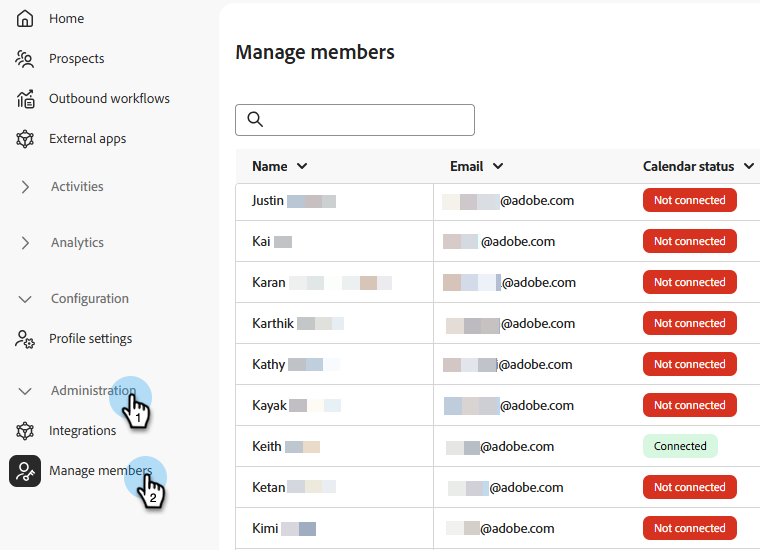

# Meetings {#meetings}

Adobe Brand Conciergeの&#x200B;_会議_&#x200B;のすべての設定を確認します。 カレンダーの接続、空き状況の設定、分析結果の表示など、さまざまな機能を利用できます。

>[!NOTE]
>
>[会議を予約](../getting-started/meeting-booking.md)のビデオを視聴することもできます。

## 設定 {#configuration}

OutlookやGoogleのアカウントに接続し、曜日、タイムゾーン、ミーティング期間などの設定を指定します。

### カレンダーの接続 {#connect}

1. [Adobe Experience Platform](https://experience.adobe.com/){target="_blank"}にログインします。

1. **[!UICONTROL 販売修飾子]**&#x200B;を選択します。

   {width="800" zoomable="yes"}

1. _設定_&#x200B;で、**プロファイル設定**&#x200B;をクリックします。 「**[!UICONTROL カレンダー設定]**」タブで、目的のカレンダーを選択します。

   

1. 既にサインインしているアカウントを選択するか、新しいアカウントを追加します。

   

1. 接続が完了したら、目的のメールコンテンツを指定します。

   これは、受信者が自分との会議を予約したときに送信されるコンテンツです。 Microsoft Teams会議リンクを含めることもできます（オプション）。

   

1. 「**[!UICONTROL 保存]**」をクリックします。

### カレンダーの空き状況の設定 {#calendar-availability}

1. 「**[!UICONTROL カレンダーの空き状況]**」タブをクリックします。

   

1. 必要な設定を選択します。

   >[!NOTE]
   >
   >さらに時間オプションを追加するには、プラス記号（）をクリックします。

   すべてのフィールドが入力された

1. 「**[!UICONTROL 保存]**」をクリックします。

### ライブチャットの利用状況の設定 {#chat-availability}

1. 「**[!UICONTROL ライブチャットの利用状況]**」タブをクリックし、必要な設定を選択します。 終了したら「**保存**」をクリックします。

   

### メンバーを管理 {#manage}

**管理者のみ**。 カレンダーの接続に成功した担当者を確認します。

## アクティビティ {#activities}

「**[!UICONTROL ミーティング予約]**」をクリックして、予約されたミーティングを確認し、どのような情報がキャプチャされたかを確認し、ミーティングがいつスケジュールされたかを確認します。

### ミーティングページ {#bookings}

{width="800" zoomable="yes"}

## Analytics {#analytics}

「**[!UICONTROL ミーティングのパフォーマンス]**」をクリックして、ミーティングをリクエストした訪問者の数や欠落した訪問者の数など、複数の分析カテゴリを確認します。 ミーティングのトレンドや、ミーティングに参加した代表者など、様々な情報を確認できます。

### ミーティングページ {#performance}

{width="800" zoomable="yes"}
